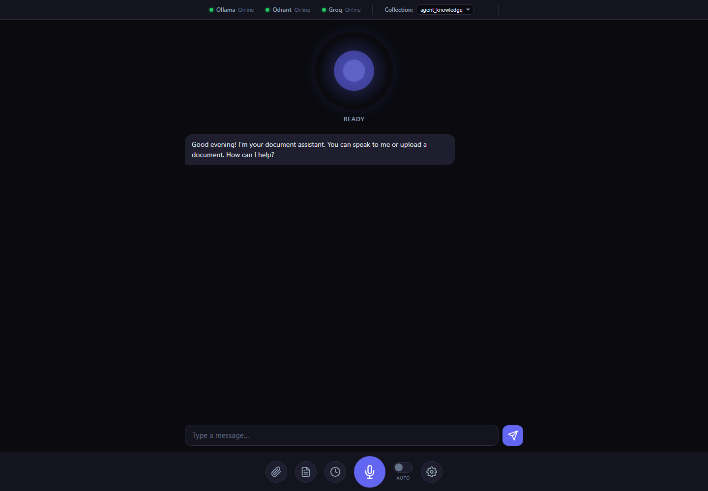
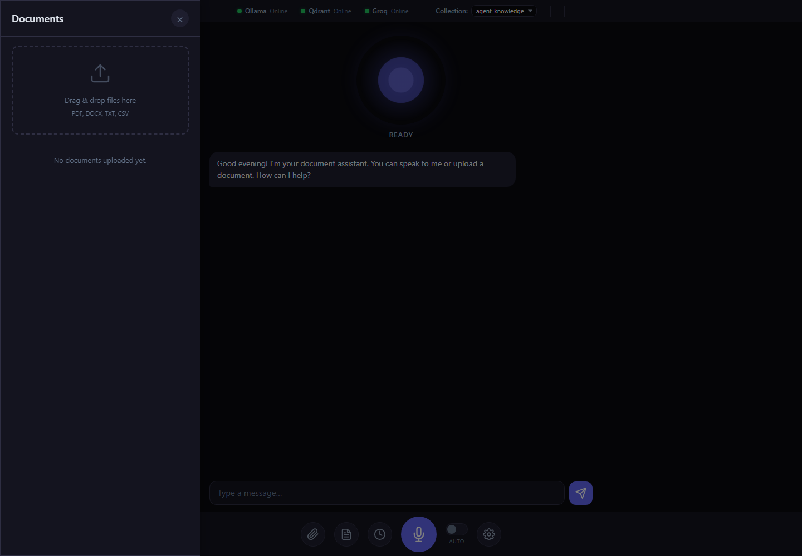
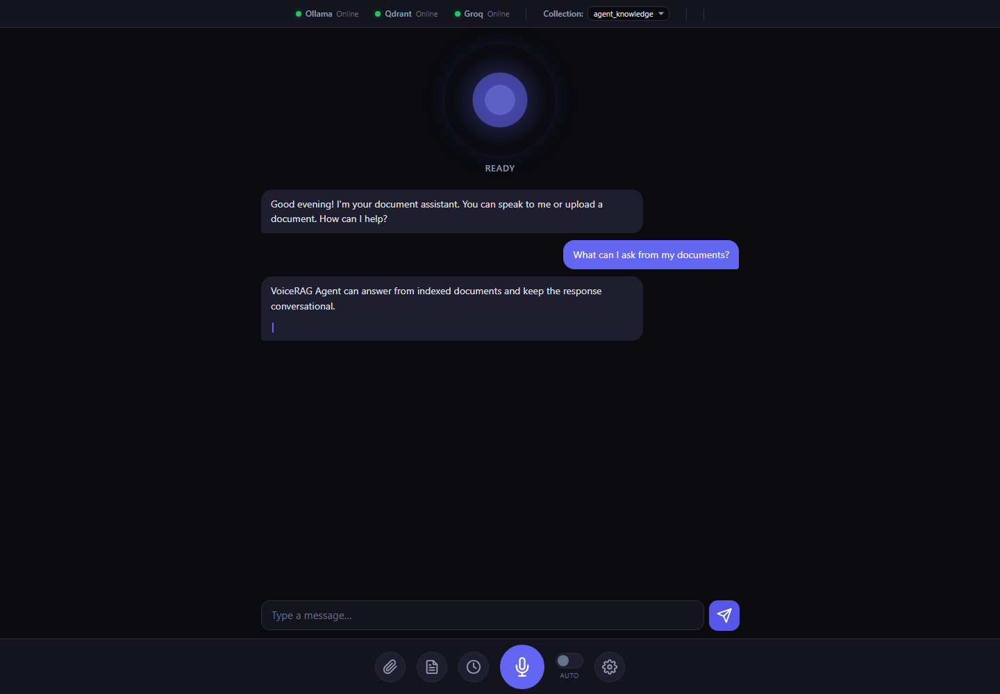
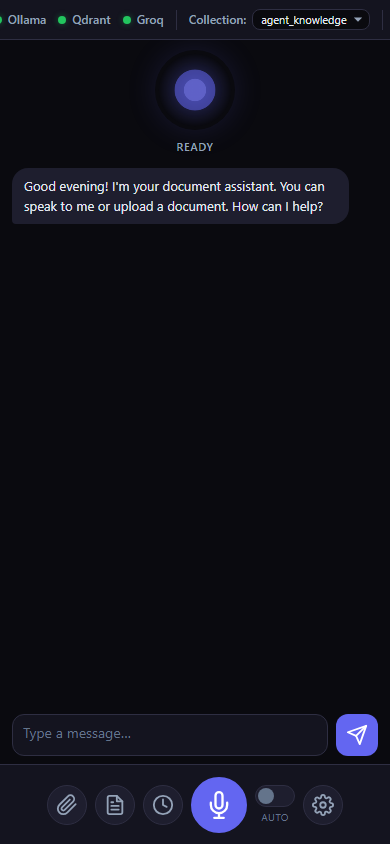

# VoiceRAG Agent

[](https://github.com/RossDmello2/voice-rag-agent/actions/workflows/ci.yml)
[](https://github.com/RossDmello2/voice-rag-agent/actions/workflows/codeql.yml)
[](LICENSE)
[](https://www.python.org/)
[](https://fastapi.tiangolo.com/)

> Local-first voice-to-voice RAG assistant with FastAPI, vanilla JavaScript, LangGraph, Qdrant, Ollama embeddings, Groq STT/chat, Kokoro ONNX TTS, and SQLite auth.



VoiceRAG Agent is a self-hosted assistant for talking to your documents. It serves a browser UI from FastAPI, accepts typed or spoken questions, retrieves context from Qdrant using Ollama embeddings, streams responses with Server-Sent Events, and can synthesize speech through Kokoro ONNX.

The project is local-first, but not fully offline by default: Groq-backed speech-to-text, translation, and chat use cloud APIs when those providers are enabled.

More real UI views:

| Document panel | Chat workflow | Mobile layout |
| --- | --- | --- |
|  |  |  |

## Table of Contents

- [What It Does](#what-it-does)
- [Architecture](#architecture)
- [Feature Map](#feature-map)
- [Quick Start](#quick-start)
- [Configuration](#configuration)
- [Project Structure](#project-structure)
- [Running Tests](#running-tests)
- [API Reference](#api-reference)
- [Deployment](#deployment)
- [Contributing](#contributing)
- [Security](#security)
- [License](#license)

## What It Does

- Serves a vanilla JavaScript voice-agent UI directly from FastAPI.
- Streams chat responses over `/chat` and `/chat/stream`.
- Registers and logs in local users with JWT bearer tokens backed by SQLite.
- Protects document ingestion and collection mutations while keeping local read/chat flows low-friction.
- Ingests PDF, DOCX, TXT, and CSV documents into Qdrant for retrieval-augmented answers.
- Uses sanitized filenames and validates vector writes before reporting ingest success.
- Renders assistant Markdown through a safe sanitizer before DOM insertion.
- Uses Ollama embeddings and optional Ollama chat fallback for local model workflows.
- Uses Groq for cloud chat, translation, and Whisper speech-to-text.
- Runs a LangGraph voice pipeline for translation, intent detection, retrieval, response generation, and speech synthesis.
- Supports Kokoro ONNX TTS with local model artifacts under `voice_agent_backend/data/models/`.
- Exposes dependency health checks for Qdrant, Ollama, Groq, and local model availability.
- Includes backend tests and Playwright frontend tests.

## Architecture

The runtime application lives in `voice_agent_backend/app`. FastAPI mounts the frontend, registers API routers, initializes SQLite, and warms the speech pipeline on startup. The chat path combines intent classification, session memory, Qdrant retrieval, Groq or Ollama generation, and optional Kokoro audio output.

```text
Browser UI
  -> FastAPI routes
  -> Auth, schema, and config boundaries
  -> LangGraph and RAG services
  -> Qdrant, Ollama, Groq, Kokoro, SQLite
  -> SSE, JSON, or audio response
```

The current architecture guide is [docs/architecture/README.md](docs/architecture/README.md). Historical discovery notes remain in [docs/intelligence](docs/intelligence/) and should not be treated as the current source of truth.

## Feature Map

Feature ownership and extension guidance live in [docs/features/README.md](docs/features/README.md). Start there before changing auth, chat, RAG, collection management, STT, TTS, health, model, or frontend behavior.

## Quick Start

### Prerequisites

- Python 3.10 or newer; Python 3.11 is recommended.
- Node.js for `node --check` and Playwright browser-test tooling.
- Qdrant running on port `6333` for document search.
- Ollama running on port `11434` with `mxbai-embed-large:latest` for embeddings.
- A Groq API key if using Groq chat, translation, or STT.
- Optional: CUDA-compatible ONNX Runtime setup for Kokoro GPU TTS.

### Installation

```bash
git clone https://github.com/RossDmello2/voice-rag-agent.git
cd voice-rag-agent
python -m venv venv
source venv/bin/activate   # Windows: venv\Scripts\activate
pip install -r voice_agent_backend/requirements.txt
pip install -r requirements-dev.txt  # for tests and Playwright browser checks
python -m playwright install chromium
cp .env.example voice_agent_backend/.env
# Edit voice_agent_backend/.env before starting the app.
```

### Running

Start Qdrant:

```bash
docker run -p 6333:6333 qdrant/qdrant
```

Start the backend and frontend:

```bash
cd voice_agent_backend
python -m uvicorn app.main:app --host 0.0.0.0 --port 8000 --reload
```

Open `http://localhost:8000`.

## Configuration

All runtime configuration is read from `voice_agent_backend/.env`. Copy `.env.example` from the repository root and fill in the required values.

| Variable | Required | Default | Description |
| --- | --- | --- | --- |
| `APP_ENV` | No | `local` | Runtime mode. Use `production` outside local/dev/test; production rejects fallback secrets. |
| `DATABASE_URL` | No | local SQLite file | Optional SQLAlchemy database URL. Leave blank to use `voice_agent_backend/data/sqlite/voice_agent.db`. |
| `OLLAMA_BASE` | No | `http://localhost:11434` | Ollama API base URL for embeddings and optional chat. |
| `QDRANT_BASE` | No | `http://localhost:6333` | Qdrant API base URL. |
| `GROQ_BASE` | No | `https://api.groq.com/openai/v1` | Groq OpenAI-compatible API base URL. |
| `GROQ_API_KEY` | Yes for Groq/STT | none | Groq API key. |
| `CHAT_PROVIDER` | No | `groq` | Chat provider: `groq` or `ollama`. |
| `CHAT_MODEL` | No | `llama-3.1-8b-instant` | Default chat model. |
| `EMBED_MODEL` | No | `mxbai-embed-large:latest` | Default Ollama embedding model. |
| `TRANSLATION_PROVIDER` | No | `groq` | Translation provider. |
| `TRANSLATION_MODEL` | No | `llama-3.1-8b-instant` | Translation model. |
| `DEFAULT_COLLECTION` | No | `agent_knowledge` | Default Qdrant collection. |
| `SECRET_KEY` | Yes | none in template | JWT signing key. |
| `KOKORO_MODE` | No | `native` | TTS mode: `native`, `docker`, or `disabled`. |
| `KOKORO_MODEL_PATH` | No | `data/models/kokoro-v1.0.onnx` | Kokoro ONNX model path relative to `voice_agent_backend`. |
| `KOKORO_VOICES_PATH` | No | `data/models/voices-v1.0.bin` | Kokoro voice artifact path relative to `voice_agent_backend`. |

See [.env.example](.env.example) for the full configuration surface.

## Project Structure

```text
voice-rag-agent/
|-- .github/                       GitHub workflows and issue/PR templates
|-- docs/
|   |-- README.md                   Contributor documentation index
|   |-- architecture/README.md      Current architecture guide
|   |-- assets/                     Screenshots, demo media, and social preview
|   |-- deployment.md               Docker and hosting notes
|   |-- features/README.md          Feature ownership map
|   |-- guides/                     Handoff and operation guides
|   |-- intelligence/               Historical discovery and audit evidence
|   |-- operations/                 Current productionization and readiness truth
|   `-- specs/                      Migration and technical plans
|-- voice_agent_backend/
|   |-- app/                        FastAPI application code
|   |-- data/                       Local model and SQLite paths; artifacts are ignored
|   |-- frontend/                   Same-origin vanilla JavaScript UI
|   |-- scripts/checks/             Developer verification checks
|   |-- scripts/manual_tests/       Provider and graph smoke scripts
|   `-- tests/                      Backend and frontend tests
|-- .env.example                    Safe environment template
|-- CONTRIBUTING.md                 Contributor workflow
|-- SECURITY.md                     Vulnerability reporting policy
`-- README.md
```

## Running Tests

```bash
# Secret and local artifact ignore check
git check-ignore voice_agent_backend/.env voice_agent_backend/data/models/kokoro-v1.0.onnx voice_agent_backend/data/sqlite/voice_agent.db

# JavaScript syntax check
node --check voice_agent_backend/frontend/script.js

# Backend and frontend test suites
cd voice_agent_backend
python -m compileall app scripts tests
python -m pytest tests/backend tests/frontend -q
python scripts/checks/import_smoke.py
python -c "from app.main import app; print(app.title)"
```

Use browser smoke testing after frontend changes. Provider-level runtime checks require configured Qdrant, Ollama, Kokoro artifacts, and Groq credentials.

## API Reference

| Method | Path | Description | Auth |
| --- | --- | --- | --- |
| `POST` | `/auth/register` | Register a local user and return a bearer token. | No |
| `POST` | `/auth/login` | Login with OAuth2 form credentials and return a bearer token. | No |
| `POST` | `/chat` | Stream legacy chat/RAG responses over SSE. | No |
| `POST` | `/chat/predict` | Warm predictive RAG cache for an in-progress query. | No |
| `POST` | `/chat/backchannel/{session_id}` | Emit a precomputed voice backchannel. | No |
| `POST` | `/chat/stream` | Stream the LangGraph voice pipeline over SSE. | No |
| `POST` | `/chat/interrupt/{thread_id}` | Resume an interrupted LangGraph thread. | No |
| `POST` | `/ingest` | Upload and index a PDF, DOCX, TXT, or CSV file. | Yes |
| `POST` | `/stt` | Transcribe uploaded audio with Groq Whisper. | No |
| `POST` | `/tts/generate` | Stream Kokoro TTS audio for text. | No |
| `GET` | `/collections` | List Qdrant collections. | No |
| `POST` | `/collections` | Create a Qdrant collection. | Yes |
| `DELETE` | `/collections/{collection_name}` | Delete a Qdrant collection. | Yes |
| `GET` | `/collections/{collection_name}/documents` | List indexed documents in a collection. | No |
| `DELETE` | `/collections/{collection_name}/documents/{filename}` | Delete one document from a collection. | Yes |
| `GET` | `/health` | Check Qdrant, Ollama, Groq, and model availability. | No |
| `GET` | `/models` | List available chat, embedding, and TTS model options. | No |

Non-trivial request models are defined in [voice_agent_backend/app/models/schemas.py](voice_agent_backend/app/models/schemas.py). Authentication helpers are in [voice_agent_backend/app/core/auth.py](voice_agent_backend/app/core/auth.py).

## Deployment

See [docs/deployment.md](docs/deployment.md) for Docker, provider, and local artifact notes.

For public exposure, configure production secrets, restrict CORS, keep provider keys server-side, and consider broader auth for cost-bearing chat/STT/TTS endpoints. `ALLOWED_HOSTS` is currently configuration only; add host enforcement middleware before relying on it as a deployment control.

## Contributing

See [CONTRIBUTING.md](CONTRIBUTING.md) for development setup, architecture boundaries, and pull request requirements. New contributors should also read [docs/README.md](docs/README.md).

## Security

See [SECURITY.md](SECURITY.md) for vulnerability reporting. Do not report private keys, `.env` contents, model artifacts, or SQLite data in public issues.

Current open security follow-ups are documented in [docs/operations/VERIFICATION_MATRIX.md](docs/operations/VERIFICATION_MATRIX.md). CodeQL is enabled and passing, but unresolved code-scanning alerts should be addressed before treating a hosted public deployment as hardened.

## Current Status

**READY WITH GAPS.** The repository is public, documented, tested, and remotely verified, but provider-level smoke tests need local Qdrant/Ollama/Kokoro artifacts and Groq credentials, GitHub social preview upload is a manual repository-settings step, and CodeQL has open alerts that require core-code fixes outside this docs-only pass.

## License

This project is licensed under the MIT License. See [LICENSE](LICENSE).
