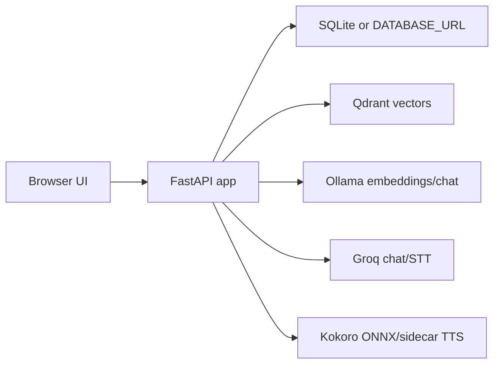

# SA-1: Architecture Report

Generated: 2026-05-28 11:20:25 +0530
Project root: C:/Users/rossd/OneDrive/Desktop/logic/voice_agent
Runtime app root: voice_agent_backend/
Output directory: C:/Users/rossd/OneDrive/Desktop/logic/voice_agent/docs/intelligence/2026-05-28-codebase-intelligence-v3
Artifact budget: exhaustive
Target platforms: vercel, render, railway
Deployment mode: detect
Secret policy: voice_agent_backend/.env was not read; only path, size, and ignore status were recorded.

Line-count note: this report is concise because architecture is a single FastAPI process plus external services; required sections are present.

## System Purpose
The system is a local-first voice/RAG assistant: FastAPI serves a browser UI, accepts chat/speech/documents, retrieves context from Qdrant, calls Groq or Ollama, and streams text/audio back (`README.md:7`, `README.md:24-35`).

## Architectural Pattern
- Single FastAPI monolith serving API and static frontend (`voice_agent_backend/app/main.py:41`, `voice_agent_backend/app/main.py:122`).
- Browser owns microphone/UI/localStorage state (`voice_agent_backend/frontend/script.js:70-91`).
- SQLite owns auth records by default (`voice_agent_backend/app/core/database.py:8-12`).
- Qdrant owns vector payloads (`voice_agent_backend/app/services/qdrant_service.py:209-225`).
- LangGraph owns graph execution with in-memory checkpointing (`voice_agent_backend/app/core/voice_graph.py:114-119`).

## Process Map

## Runtime Flow Traces
- Legacy `/chat`: translate, normalize, prompt-injection guard, document existence cache, parallel intent/retrieval, LLM stream, source/intent SSE (`voice_agent_backend/app/api/routes/chat.py:52-288`).
- Graph `/chat/stream`: builds initial graph state, starts side-car backchannel task, streams `compiled_graph.astream` events as SSE (`voice_agent_backend/app/api/routes/chat.py:353-485`).
- Ingest `/ingest`: bearer auth, size/extension validation, filename sanitization, extraction, chunking, embeddings, Qdrant acknowledgement (`voice_agent_backend/app/api/routes/ingest.py:421-470`).

## State Ownership
| State | Owner | Persistence | Evidence |
| --- | --- | --- | --- |
| users | SQLite/DATABASE_URL | persistent | voice_agent_backend/app/models/user.py:6-13 |
| JWT token | browser localStorage + server verification | client persistent | voice_agent_backend/frontend/script.js:70-91 |
| conversation memory | memory_store | process-local | voice_agent_backend/app/api/routes/chat.py:61-63 |
| retrieval/backchannel caches | module globals | process-local | voice_agent_backend/app/api/routes/chat.py:40-49 |
| graph checkpoint | LangGraph MemorySaver | process-local | voice_agent_backend/app/core/voice_graph.py:114-119 |
| document vectors | Qdrant | external vector store | voice_agent_backend/app/api/routes/ingest.py:390-403 |

## Configuration Flow
Settings load from `voice_agent_backend/.env` through `model_config` (`voice_agent_backend/app/core/config.py:52-54`, `voice_agent_backend/app/core/config.py:170`). Main app and services consume settings for CORS, URLs, DB, models, and hardware (`voice_agent_backend/app/main.py:96`, `voice_agent_backend/app/services/qdrant_service.py:37`, `voice_agent_backend/app/services/groq_service.py:25`).

## Architectural Risks
| Risk | Severity | Evidence |
| --- | --- | --- |
| HIGH | Docker CMD hardcodes port 8000; Render/Railway expect platform PORT. | voice_agent_backend/Dockerfile:12 |
| HIGH | Qdrant and Ollama default to localhost, which fails in hosted deployments. | .env.example:25-26 |
| HIGH | Public STT can call Groq without auth if internet exposed. | voice_agent_backend/app/api/routes/stt.py:8 |
| HIGH | Public TTS can consume compute without auth if internet exposed. | voice_agent_backend/app/api/routes/tts.py:17 |
| HIGH | SQLite default and model artifacts require persistent storage or managed replacements. | voice_agent_backend/app/core/database.py:8-10; .env.example:54-55 |
| MEDIUM | Process-local caches and LangGraph MemorySaver are not scale-out safe. | voice_agent_backend/app/api/routes/chat.py:40-49; voice_agent_backend/app/core/voice_graph.py:114-119 |
| MEDIUM | CSP allows inline scripts and external CDNs; scripts lack SRI. | voice_agent_backend/app/main.py:30-37; voice_agent_backend/frontend/index.html:378-381 |
| MEDIUM | ALLOWED_HOSTS is configured but no TrustedHostMiddleware was found. | voice_agent_backend/app/core/config.py:124; voice_agent_backend/app/main.py:91-100 |
